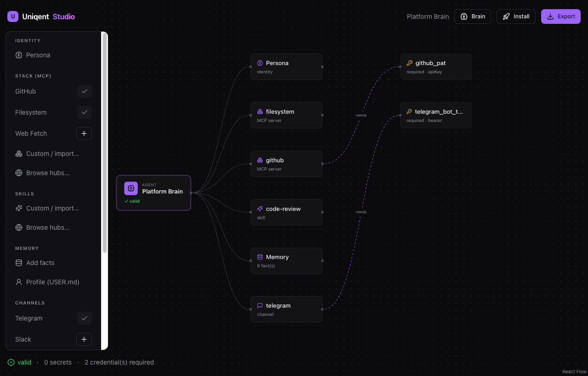
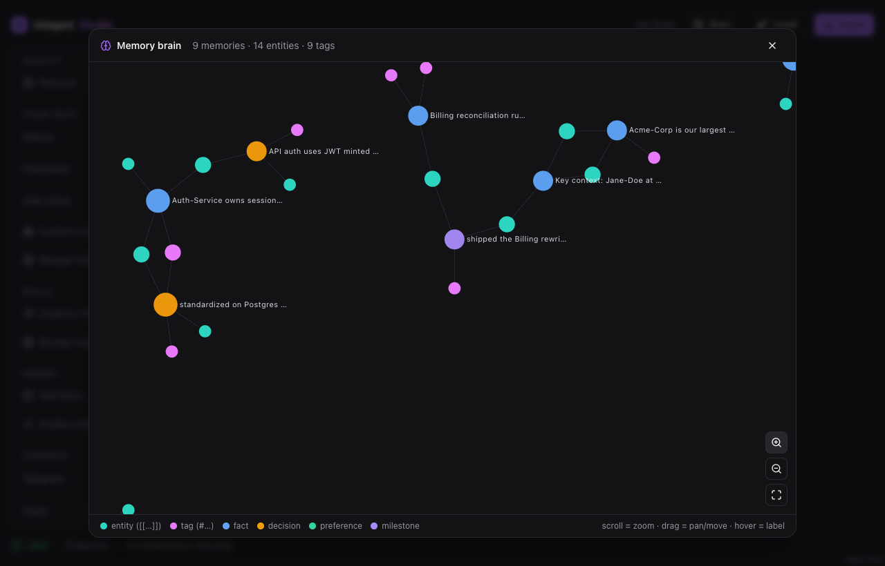

# Uniqent

[](https://github.com/RiggdAI/uniqent/actions/workflows/ci.yml)

**Any brain, any agent.** Package an AI agent's brain once — persona, MCP stack, skills, memory,
config — and install it into whatever framework you run, in one click.

An open standard + open-source toolchain for portable AI agents: the spec is **CC0**, the
toolchain is **Apache-2.0**.



<p align="center"><em>Uniqent Studio: compose a brain on an n8n-style canvas — persona, MCP stack,
skills, memory, channels — with credentials wired as "needs" edges, then export one signed
<code>.uniqent</code>.</em></p>

---

## The concept

Today, an agent's "brain" is locked inside whatever framework you built it in. If you craft a
great research agent in OpenClaw, a friend running Hermes or Claude Code can't just _have_ it.
There's no portable, shareable unit for "a whole agent."

Uniqent makes that unit, and gives you a complete workflow around it: **build → package → share
→ install.** You **compose a brain** — a persona, a stack of MCP servers, skills, memory, tools,
automations, channels, and runtime config — in **Uniqent Studio**, a local-first visual builder,
and export it as one open, signed `.uniqent` bundle. **Anyone else installs that bundle in one
click into the agent framework they already run**, and a per-framework _adapter_ translates the
brain into that framework's native layout.

> Think **n8n, but for whole agents.** A visual builder to assemble the thing, and a portable
> artifact you can install anywhere. Uniqent is the builder + packager + translator + installer —
> not where the agent runs day-to-day (that's your framework). It sits _above_ the frameworks so
> one brain travels between all of them.

Building a brain from scratch in Studio is the primary path; **capturing an existing agent**
(`uniqent export`) is the secondary on-ramp. Studio runs locally and open source — your brain and
your secrets never leave your machine.

### A "brain" = everything that makes an agent that agent

| Part             | What it is                                                              |
| ---------------- | ----------------------------------------------------------------------- |
| **Persona**      | personality, voice, role, goals — the identity                          |
| **Stacks (MCP)** | the MCP servers it can use (GitHub, filesystem, web, …) and which tools |
| **Skills**       | reusable, cross-agent `SKILL.md` capabilities                           |
| **Memory**       | durable facts, decisions, preferences, a user/agent profile             |
| **Tools**        | native built-ins it has on (web search, browser, code exec, …)          |
| **Automations**  | scheduled/triggered tasks (e.g. a daily briefing)                       |
| **Channels**     | where it's reachable (Telegram, Discord, Slack, …)                      |
| **Config**       | model/provider prefs, autonomy level, allowlists                        |

You compose those, run `uniqent pack`, and get one signed file. That file is the brain.

Memory isn't a flat list: write facts with Obsidian-style `[[entities]]` and `#tags` and Studio
parses them into an interactive **"memory brain"** — a force-directed graph (zoom / pan / drag) of
how facts, people, and topics connect. Ideal for handing a departing person's context to the next.



### One brain → install into any agent

The same bundle installs into whichever framework the recipient runs. An **adapter** per
framework does the translation (each stores brains/memory/config differently):

- **OpenClaw** — local agent, full file-based config. _(v1 target)_
- **Hermes** — local agent with bounded memory; the adapter prioritizes and reports what it trims. _(v1 target)_
- **Claude Code** — skills, MCP servers, and persona-as-instructions. _(v1 target)_
- **Codex, Cursor, Gemini, …** — _planned after v1._

> **"Install into Claude" means the file-based surfaces — Claude Code / Claude Desktop** (which
> accept skills, MCP servers, and instructions). The managed claude.ai chat app is more
> constrained (skills + connectors, but you can't freely write arbitrary memory/config), so it's a
> partial target, not a full one. We say what's real rather than over-promise.

---

## Who it's for

- **Team & knowledge continuity** — when a great hire leaves, their agent's "brain" usually leaves
  with them. Capture it as a bundle and hand it to the next person — the persona, the decisions,
  the workflows, the context — so institutional knowledge stays with the company.
- **Onboarding** — give every new hire a working, opinionated agent on day one instead of a blank slate.
- **Sharing great agents** — publish a brain you built so anyone can run it, regardless of which
  framework they use.
- **Switching frameworks** — move your agent from one framework to another without rebuilding it.

## Why it's different (and defensible)

The idea exists in primitive form elsewhere (e.g. `.dotagents`-style sharing). Uniqent's edge is
doing it **truly cross-framework, with real memory, with trust built in, fully open** — four
things the primitive versions lack:

- **Install is a translation, not a copy.** One canonical format → per-adapter native output. When
  a target can't hold something (e.g. Hermes' memory limits), it truncates/transforms **and reports
  exactly what changed**. Lossy is acceptable; _silent_ loss is not.
- **Secrets never travel in a bundle.** A bundle carries the _wiring_ (which MCP server, transport,
  auth _type_, which tools) but **never API keys**. At install time the recipient is prompted for
  their own keys, or runs the OAuth flow locally; secrets land in the target framework's own
  credential store. That's what makes a bundle safe to post publicly and still instantly runnable.
- **No hosted dependency.** Bundles install from a raw file or a URL (e.g. straight from GitHub).
  A registry is optional convenience, never required.
- **Trust is first-class.** Ed25519 signing over a content digest, a permission sheet shown before
  any write, a memory preview you can redact, and a sandboxed dry-run — all in v1.

### How it works

**Build → Pack → Share → Install** — one open bundle, any framework. Build a brain in Studio (or
capture an existing agent), pack it into a signed `.uniqent` that carries no secrets, share it as a
file or URL, and install it anywhere — the adapter translates it to the target's native layout and
asks only for the recipient's own credentials.

```
                BUILD
        ┌──────────────────────┐
        │ Studio (local,       │ ◀── or export an
        │ visual)              │     existing agent
        └───────────┬──────────┘
                    │  validate + secret-scan
                    ▼
             PACK + SIGN
        ┌──────────────────────┐
        │ .uniqent             │
        │ persona · MCP ·      │
        │ skills · memory ·    │
        │ tools · tasks        │
        │ (NO secrets)         │
        └───────────┬──────────┘
                    │  sign (Ed25519)
                    ▼
                SHARE
        ┌──────────────────────┐
        │ raw file · URL ·     │
        │ registry             │
        │ (no service needed)  │
        └───────────┬──────────┘
                    │
                    ▼
               INSTALL
        ┌──────────────────────┐
        │ verify signature     │
        │ → translate (native) │
        │ → permission sheet   │
        │ → resolve YOUR creds │
        │ → sandbox dry-run    │
        │ → apply              │
        └───────────┬──────────┘
                    │
                    ▼
   Claude Code · Hermes · OpenClaw
```

> In one line: anyone packages a full agent — brain, MCP stacks, skills, memory, config — into one
> open bundle; any recipient one-click installs it into their framework, where an adapter translates
> it to that framework's native setup and prompts only for their own credentials.

---

## Status

Pre-1.0, under active development — but the core loop works today:

- **Spec · core · builder** — the `.uniqent` schema, bundle read/write + validation + secret-scan +
  Ed25519 signing, and a framework-agnostic engine to assemble a brain. ✅
- **Uniqent Studio** — a local-first React canvas to build a brain (persona, MCP, skills, memory,
  channels, flows; catalog + custom + import) and export a signed `.uniqent`. ✅
- **Install** — three adapters (Claude Code, Hermes, OpenClaw) + the `uniqent` CLI and a Studio
  "Install" button install an exported brain into the chosen framework, with credentials resolved
  locally. The **same signed `.uniqent`** installs into all three — Hermes truncates memory to its
  bounded budget and reports it; Claude Code transforms it. ✅
- **Distribute** — three example brains in `examples/`, plus a file-based registry (`search` +
  install-by-slug against any hosted `index.json` — no service required). ✅
- **Next** — a hosted registry service + a `uniqent://` web "Install" handoff; Codex/Cursor/Gemini
  adapters.

See [`docs/BUILD_PLAN.md`](docs/BUILD_PLAN.md) for the plan and [`docs/SPEC.md`](docs/SPEC.md) for the
bundle-format reference.

## Quickstart

Requires Node 22.13+ and pnpm (the repo pins pnpm via `packageManager`; `corepack enable` provisions it).

```bash
pnpm install
pnpm build
pnpm test

# Launch the visual builder (local-first); open the URL it prints:
pnpm --filter @uniqent/studio start

# Pack an example brain and install it into any framework (claude-code | hermes | openclaw):
node packages/cli/dist/bin.js pack examples/dev-powerpack -o dev-powerpack.uniqent
node packages/cli/dist/bin.js inspect dev-powerpack.uniqent
node packages/cli/dist/bin.js install dev-powerpack.uniqent --target hermes --root . --cred github_pat=…

# Install straight from a raw URL (no registry), or by slug from any hosted index.json:
node packages/cli/dist/bin.js install https://example.com/dev-powerpack.uniqent --target openclaw --root .
export UNIQENT_REGISTRY=https://raw.githubusercontent.com/RiggdAI/uniqent/main/registry/index.json
node packages/cli/dist/bin.js search coding
node packages/cli/dist/bin.js install dev-powerpack --target claude-code --root .

# Discover MCP servers + skills across hubs (MCP Registry, Smithery, GitHub):
node packages/cli/dist/bin.js hub mcp github
node packages/cli/dist/bin.js hub skills "code review"
```

## Layout

```
packages/spec/                 # the .uniqent schema (zod → JSON Schema → SPEC.md)        ✅
packages/core/                 # bundle read/write, validation, signing, secret-scan      ✅
packages/builder/              # framework-agnostic "assemble a brain" engine + catalogs   ✅
apps/studio/                   # Uniqent Studio — the local-first visual builder           ✅
packages/cli/                  # the `uniqent` CLI (inspect/install/validate/pack/search)   ✅
packages/adapter-sdk/          # Adapter interface + conformance harness                   ✅
packages/adapter-claude-code/  # installs a brain into Claude Code                         ✅
packages/adapter-hermes/       # installs into Hermes (bounded memory)                     ✅
packages/adapter-openclaw/     # installs into OpenClaw                                    ✅
examples/                      # three ready-to-install example brains                     ✅
registry/                      # sample registry index.json + format (file-based)          ✅
docs/                          # SPEC, BUILD_PLAN, GOVERNANCE, CONTRIBUTING, SECURITY
```

## License

- Code (CLI + adapters + core): **Apache-2.0** ([`LICENSE`](LICENSE))
- The spec text + schema: **CC0** ([`LICENSE-SPEC`](LICENSE-SPEC)) — so any framework can implement
  an adapter without asking permission.

## Contributing

See [`docs/CONTRIBUTING.md`](docs/CONTRIBUTING.md) and [`docs/GOVERNANCE.md`](docs/GOVERNANCE.md).
Security disclosures: [`docs/SECURITY.md`](docs/SECURITY.md).
