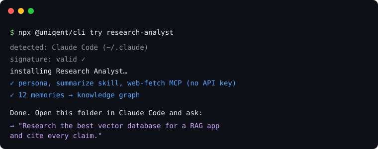

# Uniqent ☉

[](https://github.com/RiggdAI/uniqent/actions/workflows/ci.yml)
[](https://www.npmjs.com/package/@uniqent/cli)
[](LICENSE)
[](LICENSE-SPEC)
[](docs/SPEC.md)


**Any brain, any agent.** Package an AI agent's whole brain once — persona, MCP stack, skills,
memory, config — into one open, signed `.uniqent` file, and install it into whatever framework you
run (Claude Code, Hermes, OpenClaw) in **one command**.

> Think **n8n, but for whole agents**: a visual builder to assemble the thing, and a portable
> artifact you can install anywhere. Uniqent is the builder + packager + translator + installer — it
> sits _above_ the frameworks so one brain travels between all of them.

## ▶ Try it in one command

No clone, no config, no API key — install a complete research-analyst brain into your agent:

```bash
npx @uniqent/cli try research-analyst
```



It auto-detects your framework, installs the persona + skill + web-fetch MCP + a linked memory
graph, then tells you exactly what to ask. Run `npx @uniqent/cli try --list` to see the featured
brains.

---

## What is Uniqent?

Today an agent's "brain" is locked inside whatever framework you built it in — there's no portable
unit for "a whole agent." Uniqent makes that unit and the workflow around it: **build → package →
share → install.** You compose a brain in **Uniqent Studio** (a local-first visual builder) — or
capture one you already have — and export a single signed `.uniqent` bundle that **carries no
secrets**. Anyone installs it into the framework they run; a per-framework **adapter** translates
the brain into that framework's native layout and asks only for the recipient's own credentials.

## What you can do

- 🚀 **Try a brain instantly** — `npx @uniqent/cli try <name>` installs a featured, signed,
  creds-free brain into your agent in one command.
- 🧩 **Build one visually** — compose persona, MCP stack, skills, memory, channels, and flows on an
  n8n-style canvas in **Studio**, with credentials wired as "needs" edges, then export one
  `.uniqent`.

  

  Memory isn't a flat list: write facts with Obsidian-style `[[entities]]` and `#tags` and Studio
  parses them into an interactive **memory brain** — a force-directed graph (zoom / pan / drag, plus
  a 3D mode) of how facts, people, and topics connect.

  

- 📥 **Bring what you have** — `uniqent export` captures a running agent; `uniqent import-vault`
  turns an Obsidian / "second-brain" vault into a brain (`SOUL.md` → persona, `USER.md` → profile,
  `MEMORY.md` + notes → memory, `[[wikilinks]]`/`#tags` preserved).
- 🔁 **Install anywhere** — the same bundle installs into Claude Code, Hermes, or OpenClaw; the
  adapter translates it and resolves your credentials locally.

---

## How it works

**Build → Pack → Share → Install** — one open bundle, any framework:

1. **Build** a brain in Studio (or capture an existing agent / vault).
2. **Pack + sign** it into a `.uniqent` (Ed25519 signature over a content digest) — a fail-closed
   secret-scan guarantees **no API keys** travel in the bundle.
3. **Share** it as a raw file or URL (e.g. straight from GitHub) — no hosted service required.
4. **Install** it: the adapter verifies the signature, shows a permission sheet, resolves _your_
   credentials locally, dry-runs in a sandbox, then writes the framework's native layout.

What makes it defensible — four things `.dotagents`-style sharing lacks:

- **Install is a translation, not a copy.** One canonical format → per-adapter native output. When a
  target can't hold something (e.g. Hermes' memory limits) it truncates/transforms **and reports
  exactly what changed**. Lossy is acceptable; _silent_ loss is not.
- **Secrets never travel in a bundle.** It carries the wiring (which MCP server, transport, auth
  _type_), never the keys — safe to post publicly and still instantly runnable.
- **No hosted dependency.** Install from a file or URL; a registry is optional convenience.
- **Trust is first-class.** Signing, a permission sheet, a redactable memory preview, and a sandboxed
  dry-run — all in v1.

### A "brain" = everything that makes an agent that agent

| Part             | What it is                                                              |
| ---------------- | ----------------------------------------------------------------------- |
| **Persona**      | personality, voice, role, goals — the identity                          |
| **About**        | a README + avatar describing the brain (travels in the bundle)          |
| **Stacks (MCP)** | the MCP servers it can use (GitHub, filesystem, web, …) and which tools |
| **Skills**       | reusable, cross-agent `SKILL.md` capabilities                           |
| **Memory**       | durable facts, decisions, preferences, a user/agent profile             |
| **Tools**        | native built-ins it has on (web search, browser, code exec, …)          |
| **Automations**  | scheduled/triggered tasks (e.g. a daily briefing)                       |
| **Channels**     | where it's reachable (Telegram, Discord, Slack, …)                      |
| **Config**       | model/provider prefs, autonomy level, allowlists                        |

### Install into any agent

| Framework               | How the brain lands                                                                                     | Status  |
| ----------------------- | ------------------------------------------------------------------------------------------------------- | ------- |
| **Claude Code**         | skills → `.claude/skills`, persona+memory → `AGENTS.md`, MCP → `.mcp.json`                              | ✅ v1   |
| **Hermes**              | persona → `SOUL.md`, **bounded** memory (prioritized + trimmed, reported), MCP/channels → `hermes.json` | ✅ v1   |
| **OpenClaw**            | persona → `SOUL.md`, memory → `MEMORY.md`, skills → `skills/`, MCP/channels → `openclaw.json`           | ✅ v1   |
| Codex · Cursor · Gemini | —                                                                                                       | planned |

---

## CLI

```bash
npm i -g @uniqent/cli      # or use npx @uniqent/cli <command>
```

| Command                                | What it does                                                                                        |
| -------------------------------------- | --------------------------------------------------------------------------------------------------- |
| `try <brain>`                          | One-command install of a featured brain (auto-detects your framework). `--list` to browse.          |
| `install <file\|url\|slug>`            | Install a brain into `--target <claude-code\|hermes\|openclaw>` (`--root <dir>`, `--cred ref=val`). |
| `inspect <file>`                       | Show a bundle's manifest, components, and permissions.                                              |
| `export --root <dir>`                  | Capture a running agent into a `.uniqent` (auto-detects the framework).                             |
| `import-vault <dir>`                   | Turn an Obsidian / second-brain vault into a signed brain.                                          |
| `pack <dir>` · `validate <dir\|file>`  | Build / check a brain from a source directory.                                                      |
| `search <q>` · `hub <mcp\|skills> <q>` | Find brains in a registry index; discover MCP servers + skills across hubs.                         |
| `keygen` · `sign <file>`               | Generate an Ed25519 keypair; sign a bundle.                                                         |

A few real flows:

```bash
# Install a brain into your framework, resolving your own credentials locally:
uniqent install my-brain.uniqent --target claude-code --root .

# Install straight from a raw URL (no registry needed):
uniqent install https://example.com/dev-powerpack.uniqent --target openclaw --root .

# Or by slug from any hosted index.json:
export UNIQENT_REGISTRY=https://raw.githubusercontent.com/RiggdAI/uniqent/main/registry/index.json
uniqent search coding && uniqent install dev-powerpack --target hermes --root . --cred github_pat=…
```

## Studio (visual builder)

```bash
pnpm --filter @uniqent/studio start   # local-first; open the URL it prints
```

## Build from source

Requires Node 22.13+ and pnpm (`corepack enable` provisions the pinned version).

```bash
pnpm install && pnpm build && pnpm test
```

---

## Docs

| Doc                                                                                         | What's in it                                                            |
| ------------------------------------------------------------------------------------------- | ----------------------------------------------------------------------- |
| [`docs/SPEC.md`](docs/SPEC.md)                                                              | The `.uniqent` bundle-format reference (generated from the zod schema). |
| [`docs/BUILD_PLAN.md`](docs/BUILD_PLAN.md)                                                  | Full engineering spec + milestone plan.                                 |
| [`docs/UX-REVIEW.md`](docs/UX-REVIEW.md)                                                    | CLI UX review + roadmap of gaps.                                        |
| [`docs/CONTRIBUTING.md`](docs/CONTRIBUTING.md) · [`docs/GOVERNANCE.md`](docs/GOVERNANCE.md) | How to contribute + project governance.                                 |
| [`docs/SECURITY.md`](docs/SECURITY.md)                                                      | Security policy + disclosures.                                          |

<details>
<summary><strong>Status</strong> — pre-1.0, core loop works today</summary>

- **Spec · core · builder** — schema, bundle read/write + validation + secret-scan + Ed25519 signing,
  and a framework-agnostic engine to assemble a brain. ✅
- **Studio** — local-first React canvas to build a brain and export a signed `.uniqent`. ✅
- **Bring what you have** — `uniqent import-vault` + `uniqent export`. ✅
- **Install** — three adapters (Claude Code, Hermes, OpenClaw) + the CLI + Studio's Install button;
  the same signed `.uniqent` installs into all three. ✅
- **Distribute** — `@uniqent/cli` on npm; example brains in `examples/`; a file-based registry;
  memory-pack publishing. ✅
- **Next** — a hosted registry (accounts/web search) + a `uniqent://` web "Install" handoff;
  Codex/Cursor/Gemini adapters.

</details>

## License

- Code (CLI + adapters + core): **Apache-2.0** ([`LICENSE`](LICENSE))
- Spec text + schema: **CC0** ([`LICENSE-SPEC`](LICENSE-SPEC)) — any framework can implement an
  adapter without asking permission.

## Contributing & community

Contributions welcome — see [`docs/CONTRIBUTING.md`](docs/CONTRIBUTING.md) and
[`docs/GOVERNANCE.md`](docs/GOVERNANCE.md). Report security issues via
[`docs/SECURITY.md`](docs/SECURITY.md).
